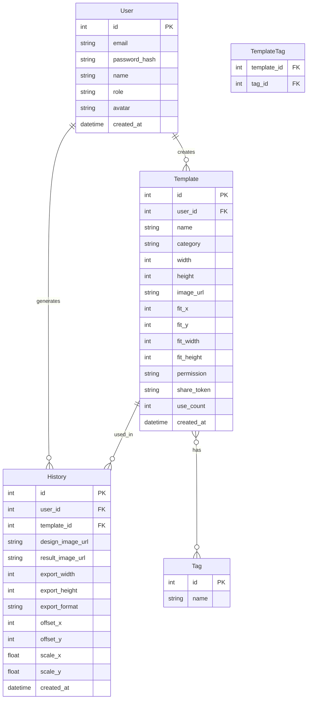

## 1. 架构设计

```mermaid
graph TB
    "前端 Vue3+Vite+Arco Design" --> "API网关 Express"
    "API网关 Express" --> "认证中间件 JWT"
    "认证中间件 JWT" --> "路由层 Router"
    "路由层 Router" --> "控制器 Controller"
    "控制器 Controller" --> "服务层 Service"
    "服务层 Service" --> "数据层 Repository"
    "数据层 Repository" --> "SQLite 数据库"
    "服务层 Service" --> "文件存储 uploads/"
    "服务层 Service" --> "图像处理 Sharp"
```

## 2. 技术说明

- 前端：Vue3 + Vite + Arco Design + TypeScript
- 初始化工具：vite-init（vue-express-ts 模板）
- 后端：Express@4 + TypeScript（ESM）
- 数据库：SQLite（better-sqlite3）
- 文件上传：multer
- 图像处理：sharp
- 用户鉴权：jsonwebtoken + bcryptjs
- 状态管理：Pinia

## 3. 路由定义

| 路由 | 用途 |
|------|------|
| / | 首页/模板库 |
| /login | 登录页 |
| /register | 注册页 |
| /upload | 模板上传页 |
| /generator | 样机生成器页 |
| /generator/:id | 指定模板的样机生成 |
| /batch | 批量生成页 |
| /history | 生成历史记录页 |
| /stats | 数据统计页 |
| /template/:id | 模板详情/分享页 |

## 4. API 定义

### 4.1 认证相关

```typescript
POST   /api/auth/register    { email, password, name }       => { token, user }
POST   /api/auth/login       { email, password }             => { token, user }
GET    /api/auth/me          Authorization: Bearer <token>   => { user }
```

### 4.2 模板相关

```typescript
GET    /api/templates           ?category=&tag=&keyword=&page=&pageSize=  => { list, total }
GET    /api/templates/:id                                                   => Template
POST   /api/templates           { name, category, width, height, tags[], permission, file } => Template
PUT    /api/templates/:id       { name, category, width, height, tags[], permission } => Template
DELETE /api/templates/:id                                                     => { success }
GET    /api/templates/:id/share                                               => { shareLink }
```

### 4.3 样机生成相关

```typescript
POST   /api/mockup/generate     { templateId, designImage, offsetX, offsetY, scaleX, scaleY, exportWidth, exportFormat } => { resultUrl, historyId }
POST   /api/mockup/batch        { items: [{ templateId, designImage, ... }] }                                => { taskId }
GET    /api/mockup/batch/:taskId                                                                            => { status, results[] }
```

### 4.4 历史记录

```typescript
GET    /api/history             ?page=&pageSize=  => { list, total }
GET    /api/history/:id                           => HistoryItem
DELETE /api/history/:id                           => { success }
GET    /api/history/:id/download                   => File (下载)
```

### 4.5 数据统计

```typescript
GET    /api/stats/overview                        => { totalTemplates, totalGenerations, totalUsers, todayGenerations }
GET    /api/stats/popular-templates  ?limit=10    => { list: Template & usageCount }
```

### 4.6 文件上传

```typescript
POST   /api/upload/template-image   multipart/form-data  => { url, width, height }
POST   /api/upload/design-image     multipart/form-data  => { url, width, height }
```

## 5. 服务端架构图

```mermaid
graph LR
    "Controller" --> "Service"
    "Service" --> "Repository"
    "Repository" --> "SQLite"
    "Service" --> "Sharp 图像处理"
    "Service" --> "Multer 文件上传"
    "Service" --> "FS 文件存储"
```

## 6. 数据模型

### 6.1 数据模型定义



### 6.2 数据定义语言

```sql
CREATE TABLE users (
    id INTEGER PRIMARY KEY AUTOINCREMENT,
    email TEXT NOT NULL UNIQUE,
    password_hash TEXT NOT NULL,
    name TEXT NOT NULL,
    role TEXT NOT NULL DEFAULT 'user' CHECK(role IN ('user', 'designer', 'admin')),
    avatar TEXT,
    created_at TEXT NOT NULL DEFAULT (datetime('now'))
);

CREATE TABLE templates (
    id INTEGER PRIMARY KEY AUTOINCREMENT,
    user_id INTEGER NOT NULL REFERENCES users(id),
    name TEXT NOT NULL,
    category TEXT NOT NULL CHECK(category IN ('poster', 'phone', 'computer', 'packaging')),
    width INTEGER NOT NULL,
    height INTEGER NOT NULL,
    image_url TEXT NOT NULL,
    fit_x INTEGER NOT NULL DEFAULT 0,
    fit_y INTEGER NOT NULL DEFAULT 0,
    fit_width INTEGER NOT NULL,
    fit_height INTEGER NOT NULL,
    permission TEXT NOT NULL DEFAULT 'public' CHECK(permission IN ('public', 'private', 'restricted')),
    share_token TEXT UNIQUE,
    use_count INTEGER NOT NULL DEFAULT 0,
    created_at TEXT NOT NULL DEFAULT (datetime('now'))
);

CREATE TABLE tags (
    id INTEGER PRIMARY KEY AUTOINCREMENT,
    name TEXT NOT NULL UNIQUE
);

CREATE TABLE template_tags (
    template_id INTEGER NOT NULL REFERENCES templates(id) ON DELETE CASCADE,
    tag_id INTEGER NOT NULL REFERENCES tags(id) ON DELETE CASCADE,
    PRIMARY KEY (template_id, tag_id)
);

CREATE TABLE history (
    id INTEGER PRIMARY KEY AUTOINCREMENT,
    user_id INTEGER NOT NULL REFERENCES users(id),
    template_id INTEGER NOT NULL REFERENCES templates(id),
    design_image_url TEXT NOT NULL,
    result_image_url TEXT NOT NULL,
    export_width INTEGER NOT NULL,
    export_height INTEGER NOT NULL,
    export_format TEXT NOT NULL DEFAULT 'png',
    offset_x INTEGER NOT NULL DEFAULT 0,
    offset_y INTEGER NOT NULL DEFAULT 0,
    scale_x REAL NOT NULL DEFAULT 1.0,
    scale_y REAL NOT NULL DEFAULT 1.0,
    created_at TEXT NOT NULL DEFAULT (datetime('now'))
);

CREATE INDEX idx_templates_category ON templates(category);
CREATE INDEX idx_templates_user_id ON templates(user_id);
CREATE INDEX idx_templates_share_token ON templates(share_token);
CREATE INDEX idx_history_user_id ON history(user_id);
CREATE INDEX idx_history_template_id ON history(template_id);
CREATE INDEX idx_history_created_at ON history(created_at);
CREATE INDEX idx_tags_name ON tags(name);
